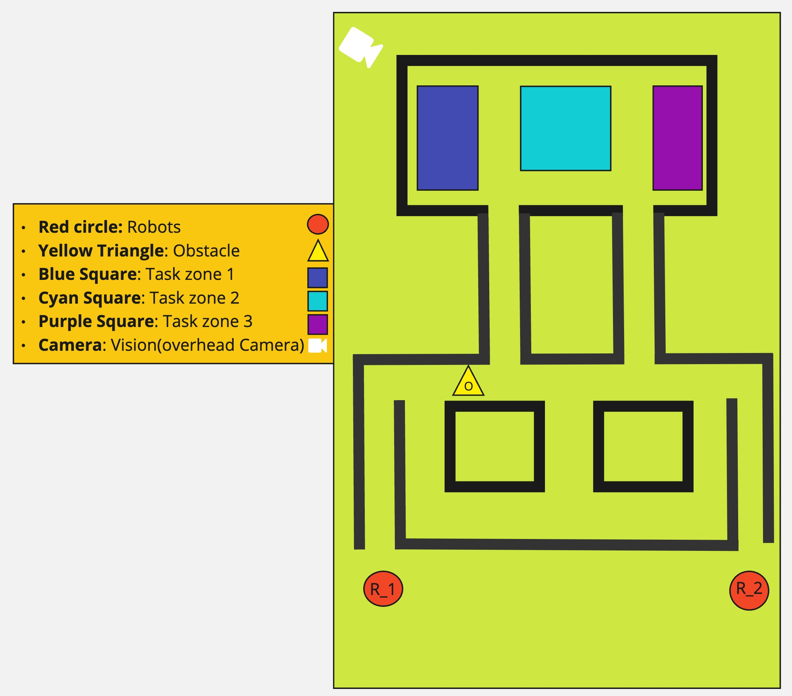

# EECS-149-2024-project

This repository will contain all of our project artifacts such as:

- code
- Mechanical Designs
- Architecture Drawings
- Reports
- Posters

## Mechanical Designs

### Demonstration layout

## Architecture Drawings

## Report documents

**Milestone 1: [Docs (view only)](https://docs.google.com/document/d/1rScEsScUIcoGwau_Ql9WleNG6Nl_FFPPY1N9IfjY0T4/edit?usp=sharing)**

**LaTex project proposal: [Overleaf (view only)](https://www.overleaf.com/read/jnxhcmdchgwh#0e1aad)**

**LaTex report: [Overleaf (view only)](https://www.overleaf.com/read/mjnbjpyyvfnd#f2ec36)**

## Useful Resources

**EECS149 Inventory Fa24 (Student Checkout): [sheets](https://docs.google.com/spreadsheets/d/1v2LrFACQgDAR7JVOlNeXz1KoTylSGIU5DAnORZ1ogkU/edit?gid=0#gid=0)**

**Project introduction slides: [ tinyurl](https://tinyurl.com/24-149projects)**

**Project ideas: [lf-lang](https://www.lf-lang.org/embedded-lab/Project.html#project-ideas)**

**Project proposal sample charter: [drive](https://drive.google.com/file/d/1HWjgUgCOMmKmGkQ-XO-0xD5rjHO2KG7c/view)**
